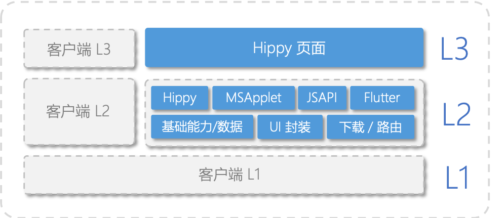

## Hippy 前端架构与路由

> https://git.code.oa.com/QQNews_CrossPlatform/QQNewsHippy

#### QQNewsHippy模块分层拆分:

| 级别 |  |  |  |  |  |  |   
| ------------ | ------------ | ------------ | ------------ | ------------ | ------------ | ------------ |  
| L3 | 各业务模块和对应API | **QNCells** 列表用Cell组件。包含单图、多图、无图等样式。| **QNListPage** 新闻列表相关组件/页面 | **QNDetail** 新闻底层页相关组件/页面定义 | | | |
| L2 | lib库封装、公共UI组件、公共数据传递model | **components/layout** 通用布局封装，用于页面的状态管理、列表显示、下拉刷新、上拉加载等。如StateView、QNListView、QNRefreshWrapper| **components/cells** Cell中不同功能部分封装。如QNCellTitle、QNCellBottomBar等。| **native-components** 由Native定义，Hippy注册生效的组件封装。如QNLottieView。| **processors** 数据获取完成到UI渲染之间的数据中间层处理，包括行数计算、标签处理、已读状态等。| | |
| L1 | 基础lib库 | **Mixins** 定义封装了应用和页面级别的生命周期、Cell生命周期的钩子函数。可在需要的页面依赖并混入。| **QNBridge** 用于Hippy和Native的交互 | **QNStyles** 样式定义，用于多module共同依赖| **Store** 封装了通用数据及配置，用于多module全局状态管理及变化监听 | **style-adapter** 用于全局的样式适配|  | 
| L0 | | | | | | | |

#### QQNewsHippy前端组件分层和路由:

#### QQNewsHippy客户端组件分层：

