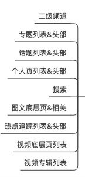

### 远程URL支持参数：
-  **qnResId**：对应客户端发布系统资源ID。客户端下载对应ID离线包。
-  **qnShowType**：webcell展示形式。0. ready后插入。1. 直接显示，h5处理loading。2.直接显示，先占位图，ready后隐藏，出错出刷新view；默认0
-  **qnAspectRatio** ：默认web宽高比。默认宽度撑满全屏，根据此参数确定初始化高度。
-  **qnDiv**：是否需要客户端添加底部分割线。0不添加，1添加，默认1

```html
例:
https://news.qq.com/book/book-channel.html?qnResId=web_resource_novel&qnShowType=2&qnAspectRatio=0.2&qnDiv=1
对应加载资源id为web_resource_novel的离线资源，默认高度=屏幕宽度*0.2
```

------------

### 资源打包
- 后缀名统一为 **.qnweb**

### 客户端发布系统 ：http://news.release.webdev.com/

### 客户端发布系统资源ID
 - 疫情趋势（专题） ： web_resource_epidemic
 - 小说频道 ： web_resource_novel
 - 热点模板 ： web_resource_newsblocks
 - 个人中心 ： web_resource_signin
 - 疫情趋势（要闻）：web_resource_epidemic_channel
 - 地方频道必读榜 ：web_resource_channel_topread
 - 小说（搜索）：web_resource_novel_search

https://news.qq.com/signin/v3/index_mini_test.html?qnResId=web_resource_signin&aspectratio=0.3826530612#/cell


#### WebCell支持列表



目前支持CapMock设置以上列表插入WebCell:

| 列表  | 图例  | Capmock规则 |
|:------------- |:---------------:| -------------:|
|热点追踪（同专题）	|| https://view.inews.qq.com/a/RSS201912240140021D|
|热推频道| 图 10 11|webcell - 热推推荐 /  webcell - 热推中热推频道|
|专题列表|图3 4|WebCell-专题列表-头部|
|个人页（主页列表）|图 6|WebCell-个人页|
|要闻/二级频道|图1 2|WebCell-二级频道|
|图文底层页相关阅读|	图 10|	WebCell-底层页相关新闻|
|搜索|	图 7|	WebCell-搜索|
|视频专辑 （不能插入到顶部）|图 8|WebCell-视频专辑列表|
|视频底层 （不能插入到顶部）|图 9	|WebCell-视频底层页|
|话题列表|图 5|WebCell-话题列表|

|   |   |  | |
|:------------- |:---------------:| -------------:|-------------:|
|||||
|||||
|||||
