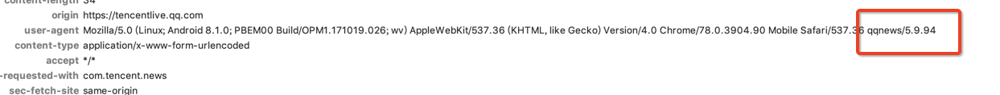

## UserAgent：

通过qqnews区分，是腾讯新闻App。

## Cookies

- 腾讯新闻登录态Cookie是种在qq.com域名下面。
- 腾讯新闻支持主账号和副账号登录。副账号用到的很少，一般只考虑主账号即可。
- 通过main_login 区分主账号的类型
	- main_login = wx 代表主登录账户为微信
	- main_login = qq 代表主登录账户为QQ

- 通过logintype区分主账号更细的登录类型：
	- logintype = 1 代表 微信登陆
	- logintype = 11 代表 qq互联登录
	- logintype = 0 代表 wtlogin QQ登录
	- logintype = 2 代表 未登录
	- logintype = 4 代表 魅族登录（很少用到）
	- logintype = 5 代表 华为登录（很少用到）

	
### 腾讯新闻H5页面内登录态Cookie格式如下：

#### 微信登录

- main_login = wx 代表主登录账户为微信。
- logintype = 1 代表微信

#### QQ互联登录

- main_login = qq 代表主登录账户为QQ。
- logintype = 11 代表 qq互联登录。

#### WtloginQQ登录

- main_login = qq 代表主登录账户为QQ。
- logintype = 0 代表 wtlogin QQ登录。

### 发送网络请求时带的cookie样式：

#### 微信登录

#### QQ互联登录

#### WtloginQQ登录

### 如何选择qq互联登录或WtLogin登录：

- 默认QQ互联
- 安卓切换WTLogin
- 
- iOS切换WTLogin
- 