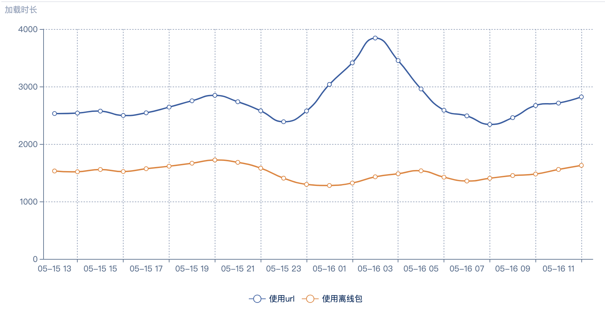
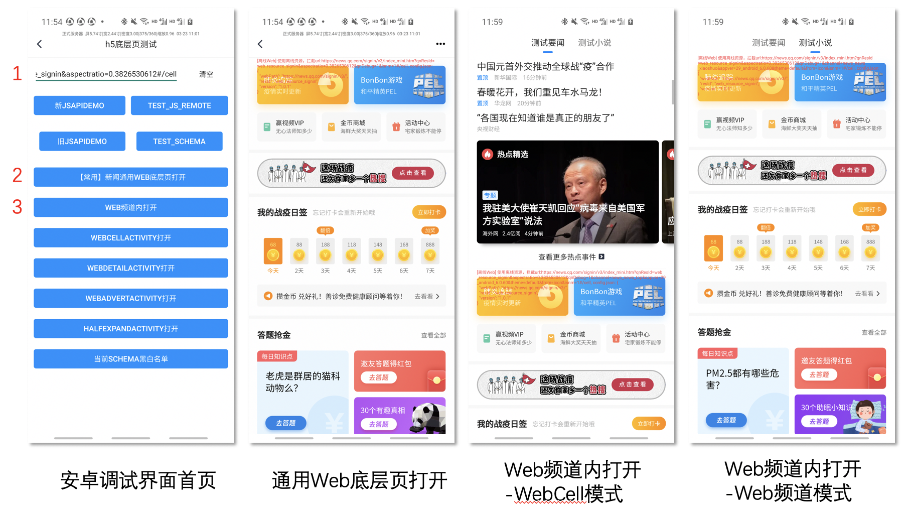

# 腾讯新闻离线包接入指引

离线包功能，是通过将 HTML/JS/CSS 等文件打包后，腾讯新闻预先下载到客户端本地，每次加载 URL 的时候优先使用本地离线包资源，极大程度上提升页面的加载速度，摆脱网络环境的影响。目前腾讯新闻客户端离线能力已经基本覆盖一级页面中的 WebCell 和 WebView，在加载耗时和稳定性上都有了较大的优化。




<br>

---

## 快速接入

#### 离线包基本生成和使用

1. 针对离线场景，将已有代码进行简单的适配，比如 domain 的判断、优先展示骨架异步加载数据等。
2. 根据规则实现配置文件 config.json ，包含资源ID，版本号以及 URL 映射关系，将代码和该文件整体打包成 .qnweb 文件。
3. 联系客户端同学将 .qnweb 文件上传到客户端资源发布平台，后续客户端提供蓝盾标准流水线自动集成。
4. 根据规则在原 URL 上添加参数(&[qnResId=](https://news.qq.com/signin/v3/epidemit.htm?qnResId=web_resource_epidemic_channel)资源ID)，客户端在加载 URL 时根据该参数优先使用离线包进行展示。

> 详见进阶功能与原理 - 2.离线包基本生成和使用

#### 离线包扩展能力

1. 客户端自动维护离线包版本更新，支持动态上下线以及特殊版本控制，支持百草发文进行分发。
2. 对于前端页面作为 Cell 形式在客户端展示，支持通过 URL 配置loading样式、默认宽高、底部分割条显隐等。

> 详见进阶功能与原理 - 3.离线包扩展能力

#### 客户端调试和Debug

1. 客户端提供全面的调试方式和场景，方便debug。

> 详见进阶功能与原理 - 4.客户端调试和Debug

<br>

---

## 原理与功能进阶

### 1. 离线包基本原理

腾讯新闻中的 Web 离线包是一个 .qnweb 格式的压缩文件，主要包含网页 HTML/JS/CSS 资源以及离线包配置文件 config.json 。


当客户端需要使用 WebView 加载 URL 展示 Web 页面时，如果客户端本地有可用的离线包资源，客户端会优先加载本地离线包资源进行展示，从而减少网络干扰、提升 Web 页面加载速度。

结合客户端资源发布平台，客户端可以完成对离线包资源版本的管理与更新；结合无为平台可以支持离线功能动态的上线、下线以及版本适配；通过客户端容错和缓存可以保证在离线资源失效的情况下使用远程资源保证展示和体验。


### 2. 离线包基本生成和使用

Web 同学对于现有页面，仅需要简单的适配，就可以使用腾讯新闻客户端离线包能力：

1. 针对离线场景，将已有代码进行简单的适配，比如 cookies 注入时 domain 判断等。
2. 根据规则实现配置文件 config.json ，将代码和该文件整体打包成 .qnweb 文件。
3. 将 .qnweb 文件上传到客户端资源发布平台。
4. 根据规则在 URL 上添加参数，客户端在加载 URL 时根据参数优先使用离线包进行展示。

#### 离线包适配

- 因为使用离线包时，客户端加载的是本地资源而非远程，所以代码中部分判断 domain 的代码需要修改，当使用离线包加载时 domain 为 localhost。常见比如 Cookies 的注入、跨域的判断等。
- 部分地址的格式需要修改，比如 "//" 写法需要补全本地相对路径。
- 为了最大程度上发挥离线包的效用，从代码实现上也可以进行优化。常见的可以优先展示页面骨架，数据再通过接口进行拉取和动态更新。这样当使用离线包加载时，就可以完全不依赖网络优先展示页面，在展示后在异步的对数据进行更新。
- 因为 Web 页面是在腾讯新闻中使用，所以需要 Web 页面适配腾讯新闻中的 JSApi 、WebCell 展示时机和高度调整、客户端生命周期等。当然这部分能力在非离线场景也需要适配，通常不需要针对离线进行调整。如果是全新业务接入参考：https://iwiki.oa.tencent.com/pages/viewpage.action?pageId=89661064

#### 离线包生成打包

- 生成配置文件 config.json。文件中实现三个字段：

  - "version" 表示当前离线包版本，用与 debug 排查。

  - "resId" 是该离线包的唯一 id ，需要和客户端资源发布平台中 id 一致，首次生成之后不再变化。 

  - "webPath" 代表离线包中入口文件路径和远程 URL 的映射关系。客户端会使用该字段的值作为 Prefix，处理远程 URL Path ，移除 Prefix 后的 subPath 作为离线包的入口文件。

    ``` json
    例如：
    远程 web url 为 https://news.qq.com/signin/v3/epidemit.htm
    
    // config.json 文件
    {
      "webPath": "https://news.qq.com/signin/v3/",
      "resId": "web_resource_epidemic_channel",
      "version": "1.4.0"
    }
    
    当客户端使用离线包时，将 webPath 作为 prefix 从远程 url 中删除，剩余 subpath 为 "/epidemit.htm"。客户端则加载离线包中的 /epidemit.htm 文件进行展示。
    ```

- 将实现好的配置文件 config.json ，和适配后的代码资源整体压缩成 Zip 文件，修改后缀名为 .qnweb 。


#### 离线包发布上传

为了离线包的安全性和版本管理，目前需要专人手动上传离线包到发布平台，请将离线包打好后联系 dequanzhu 、 genesisli 代操作上传。后续会结合蓝盾形成插件以及标准流水线，业务测实现自动化构建上传。

同时该离线包的唯一 id ，为了和客户端资源发布平台中 id 一致，首次上传时需要客户端同学协助提供，后续不再变化。

#### 离线包使用

由于离线包使用的业务越来越多，客户端考虑到用户流量不会自动下载全部离线包，整体需要在加载远程 URL 时判断是否需要，进行按需下载。这就需要注意以下两个问题：

- 当加载远程 url 时，需要 Web 同学在 URL 中增加参数来告知客户端，是否需要下载和使用对应离线包。当远程 URL 中包含参数 **qnResId** 时，客户端会解析该参数并在客户端资源平台中下载和使用对应 id 的离线包。

  ``` json
  1. 远程 url 为https://news.qq.com/signin/v3/epidemit.htm, 客户端判断不需要使用离线包能力，直接加载远程
  2. 远程 url 为https://news.qq.com/signin/v3/epidemit.htm?qnResId=web_resource_epidemic_channel, 客户端判断包含 qnResid 字段，则需要使用离线包能力，客户端自动进行离线包的使用、下载或者更新。
  ```

- 由于是通过 URL 中的参数按需加载，这就导致当没有缓存时，客户端需要下载完整的离线包资源而影响页面的展示速度，所以针对这种情况，当发现本地没有对应离线包缓存时，则首次优先使用远程加载，同时下载离线包到本地供下次使用，离线包版本更新亦是如此。

总的来说，当客户端加载 URL 时，发现 URL 中包含 **qnResId** 参数，则根据该参数的值在客户端缓存查找离线包，如果本地已经下载，则直接加载该离线包，并且同步远程查看发布平台是否有版本更新并尝试下载更新。如果本地没有离线包，则当次直接加载远程 URL 展示，同时下载离线包用于下次使用。

### 3. 离线包扩展能力

在普通离线包能力的基础之上，腾讯新闻结合常用的场景，不断的扩充了能力来完善离线包的灵活使用。同时设计了完整的调试能力方便 Web 测进行调试开发。

#### 自定义 WebCell 加载样式

除了通用的  **qnResId** 参数，针对于在客户端展示的 WebCell 类型页面，远程 URL 支持以下参数自定义加载和展示样式

- **qnResId** ：离线资源包 ID，当 url 中包含该字段时，客户端根绝 ID 使用或在发布平台进行离线包下载。
- **qnShowType**：webcell 展示形式。
  - qnShowType = 0，默认样式，cell 先隐藏，web 加载完毕后调用 JSApi 后在列表插入展示。
  - qnShowType = 1，直接显示 cell，h5处理 web 的 loading UI。
  - qnShowType = 2，直接显示 cell，客户端默认 loading UI，web 加载完毕后调用 JSApi 后 loading 隐藏。

- **qnAspectRatio** ：默认 webCell 宽高比。默认宽度撑满全屏，根据此参数确定初始化高度。
- **qnDiv**：是否需要客户端添加 Cell 底部分割线。0不添加，1添加，默认1

```json
例：
https://news.qq.com/book/book-channel.html?qnResId=web_resource_novel&qnShowType=2&qnAspectRatio=0.2&qnDiv=1

对应加载资源 id 为 web_resource_novel 的离线资源，webCell 直接展示使用客户端loading，默认 Cell 高度=屏幕宽度*0.2，cell 有底部分割线。
```


#### 离线包版本自动更新

离线包在资源发布平台上传时，支持设置该离线包最低以及最高支持的客户端版本区间。如无特殊情况，客户端会在当前版本支持的离线包中，使用最新（最后上传）的离线包。当然由于上文提到的按需加载原因，每次在加载该页面的时候才会去判断是否有更新，所以在离线包有更新之后，都是在客户端加载该页面的下次生效。

#### 动态上下线和版本控制

离线包在使用过程中，如果遇到重大的 bug 或者持续频繁需求调整时，可以在不修改 URL 和离线包的情况下，通过客户端无为平台的配置，将离线功能临时下线，客户端忽略 URL 参数以及离线能力，强制使用远程加载。待 Web 侧调整稳定后，动态配置重新上线该能力。

同时若 Web URL 后的路由变化，或者重大更新时不兼容老版本离线包，也可以在不修改 URL 的情况下，通过客户端无为平台的配置，强制忽略客户端老版本历史已下载的缓存，使用最新版本的离线包。

#### 百草发文投放

为了扩展客户端信息流更丰富的展示形态，客户端结合上下游，支持文章在信息流列表以 WebCell 样式动态展示。通过合理的离线包方案，在保证加载效果和性能的同时，丰富了展示的形态以及动态能力。目前已经支持数途、NewsBlock 等多个前端平台使用场景。


百草中生成文章类型（articleType = 225）时，通过配置展示的 URL，客户端在信息流列表中可以使用 Web 加载对应 URL 进行展示，同时遵循离线的协议支持离线包能力优化体验。


### 4. 客户端调试和Debug

#### 离线 Web 开发选项

在客户端中，可以不修改离线包和 URL 地址，本地设置使用 / 禁止离线功能来进行 Debug 和对比。通知对于使用了离线包的页面，可以设置展示弹窗便于区分。

| iOS：设置-Debug设置                                          | android：设置-开发人员选项-跨平台设置                        |
| ------------------------------------------------------------ | ------------------------------------------------------------ |
|  |  |
| 使用Web离线功能：默认开启。符合离线协议的URL，默认都会打开离线包功能，优先加载离线包。点击关闭后，关闭离线包功能全部使用线上URL加载，用于线上页面的调试。打开web离线弹窗：默认关闭。打开该开关后，符合离线协议的URL页面，当加载成功后，都会弹出Toast展示当前页面使用了离线包资源 & 线上资源，以及当前离线包的资源ID。用于线上和离线包的定位、功能对比调试等。 | 打开离线web调试信息：打开后，所有带qnResId的url，会在web顶部显示红字调试信息管理离线web包：禁用全局所有离线web包，全走url，方便开发阶段测试 |

#### 离线Web Debug 工具

对于客户端中可以出现 Web 的三个场景：列表中的 Cell 形态、列表 Web 频道形态以及 Web 独立页面形态，客户端中都有完整的 Debug 场景进行模拟，方便查看样式，以及 JSApi 适配等。

Debug 工具入口：

| iOS：设置-Debug设置-自定义h5页面                             | android：设置-h5底层页测试                                   |
| ------------------------------------------------------------ | ------------------------------------------------------------ |
|  |  |
|                                                              | 从该debug页面输入的url，如果有qnResId字段，必定优先下载离线包；没有离线包或下载失败，才用url开启 |

Debug 页面功能和使用：

| iOS debug 界面                                               | android debug 界面                                           |
| ------------------------------------------------------------ | ------------------------------------------------------------ |
|  |  |
| 1. 输入WebURL:对应web页面的URL2. 如果需要强制加载离线包资源，打开开关3. 如果需要强制加载离线包资源，输入对应的资源ID4. 调试全屏Web底层页。点击push进入新的全屏Web底层页。5. 调试WebCell或者Web频道。点击push进入测试频道页面。 | 1. 输入WebURL:对应web页面的URL2. 调试全屏Web底层页。点击push进入新的全屏Web底层页。3. 调试WebCell或者Web频道。点击push进入测试频道页面。 |

- Web底层页测试：
  - 加载对应的URL展示Web内容，用于调试页面及通用JSApi，WebPage JS Api。
  - 会包含 webPageManager 相关jsapi（独立底层页中 没有 webCellManager）：[https://iwiki.oa.tencent.com/pages/viewpage.action?pageId=89661064#id-%E6%96%B0%E9%97%BB%E5%AE%A2%E6%88%B7%E7%AB%AFJSAPI-WebPageAPI

- 列表WebCell测试：
  - 加载一个模拟频道，默认将输入的 URL 作为 WebCell 插入到第四位。用于调试WebCell以及模拟在列表的样式，切换频道以及频道列表操作调试 WebCell JS Api。
  - 会包含 webCellManager 相关jsapi：[https://iwiki.oa.tencent.com/pages/viewpage.action?pageId=89661064#id-%E6%96%B0%E9%97%BB%E5%AE%A2%E6%88%B7%E7%AB%AFJSAPI-WebCellAPI](https://iwiki.oa.tencent.com/pages/viewpage.action?pageId=89661064#id-新闻客户端JSAPI-WebCellAPI)

- WebView频道测试：
  - 加载一个模拟频道，默认将输入的 URL 作为 全屏 WebView 展示成频道。用于调试Web类型的频道页。切换频道以及频道列表操作调试 WebCell JS Api。
  - 会包含 webCellManager 相关jsapi：[https://iwiki.oa.tencent.com/pages/viewpage.action?pageId=89661064#id-%E6%96%B0%E9%97%BB%E5%AE%A2%E6%88%B7%E7%AB%AFJSAPI-WebCellAPI](https://iwiki.oa.tencent.com/pages/viewpage.action?pageId=89661064#id-新闻客户端JSAPI-WebCellAPI)

